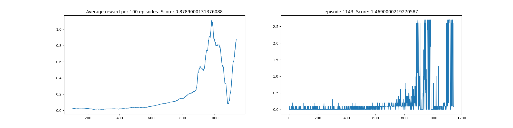
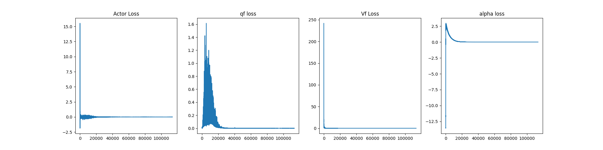

# Project Report

The goal of this project was to solve the Tenis unity environment using multi agent RL. Two agents are controlling rackets to put a ball over the net. Each agent has a local observation that is continuous of 24 dimension equivalent to the position and velocity of the ball and racket. Each agent can control the movement of the racket towards the net and also jump using a 2 dimensional vector that is continuous. The reward is either +0.1 for hitting the ball over the net and -0.01 for letting the ball touch the ground or go out of bounds. The task is solved when the average score (over 100 episode) is above 0.5. The score for each episode is the maximum of the undiscounted reward of each agent. 

### Agent Design

A centralized training, centralized execution approach was used for multi agent learning. All agents shared the same Soft Actor Critic(SAC) network. Transitions of state, action, next state and reward of all agents were stored in the same replay buffer of a maximum size 10000. Transitions from the buffer were later sampled for updating the agent. SAC is able to maximize both the agent's reward and entropy thereby leading to a much more sample efficient and stable learning process. 

### Model Architecture

Four different networks were used. Two Q-functions to reduce ploicy bias, one V-function which was softly updated to deal with stability and a actor network.

### Parameters

All Four networks were trained with adam optimizers using the same learning rate of 3e-4 and a batch size of 64. The parameters used are describe in the table below. 

|  Name | Data Type  | Use  | Value |
|:------:|:-----------:|:-----:|:------:|
| Buffer size  |  int |  configuration for maximum capacity of the replay buffer |10000|
| Learning rate  | float  |  model learing rate | 3e-4|
|  Tau | int  | Controls the soft update of target network | 5e-3|
| Epsilon Decay | float | This determines how the epsilon decreases during training| 0.9 |
| Gamma | float | discount factor | 0.99 |
|Initial Random Steps| int | determines how many random step is taken before exploiting the model |1e2 |
| Policy Update Frequency | int | determines the frequency of updating the policy | 2 |

### Results

We were able to get an average score (over 100 episode) of 0.5 in about 800 episodes. The graph of the result is shown below. The graph also includes the q-function losses, the v-function loss and the actor loss. The saved weights can be found in the model_weight directory as `model_weight/mqf1.pt`,
`model_weight/mqf2.pt`, `model_weight/mvf.pt` and `model_weight/mactor.pt`

### Credit

Most of the code structure for SAC followed this projects [here](https://github.com/MrSyee/pg-is-all-you-need)