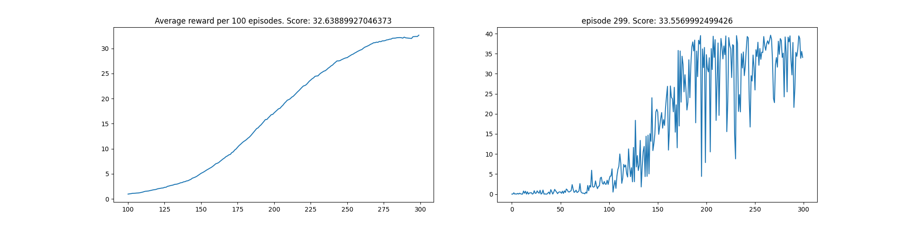
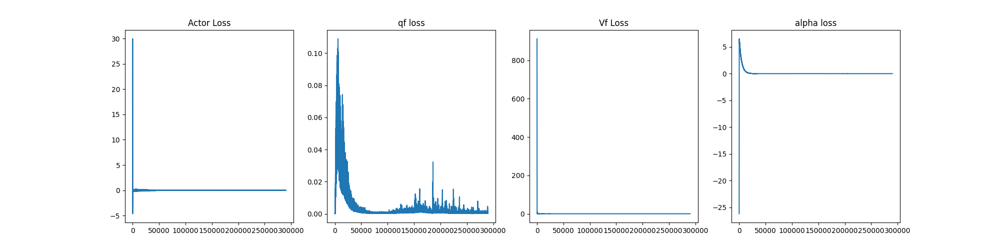

# Project Report

The goal of this project was to solve the Reacher unity environment. The agent is to be able to move an arm to a target position and keeping it there. The state space is continuous of 33 dimension. The action space is also continuous of 4 dimensions with values between -1 and 1. The reward is either +0.1 for each step leading to the arm being in the target location. The state contains position, rotation, velocity and angular velocity of the arm while the action corresponds to the torque applied to the two joints of the arm.  

### Agent Design

A Soft Actor Critic(SAC) agent was used. A transition of state, action, next state and reward were stored in a replay buffer of a maximum size 10000. Transitions from the buffer were later sampled for updating the agent. SAC is able to maximize both the agent's reward and entropy thereby leading to a much more sample efficient and stable learning process. 

### Model Architecture

Four different networks were used. Two Q-functions to reduce ploicy bias, one V-function which was softly updated to deal with stability and a actor network.

### Parameters

All Four networks were trained with adam optimizers using the same learning rate of 3e-4 and a batch size of 64. The parameters used are describe in the table below. 

|  Name | Data Type  | Use  | Value |
|:------:|:-----------:|:-----:|:------:|
| Buffer size  |  int |  configuration for maximum capacity of the replay buffer |10000|
| Learning rate  | float  |  model learing rate | 3e-4|
|  Tau | int  | Controls the soft update of target network | 4|
| Epsilon Decay | float | This determines how the epsilon decreases during training| 0.9 |
| Gamma | float | discount factor | 0.99 |
|Initial Random Steps| int | determines how many random step is taken before exploiting the model |5e3 |
| Policy Update Frequency | int | determines the frequency of updating the policy | 2 |

### Results

The agent was able to get an average score (over 100 episode) of 30 in about 275 episodes. The graph of the result is shown below. The graph also includes the q-function losses, the v-function loss and the actor loss. The saved weights can be found in the model_weight directory as `model_weight/qf1.pt`,
`model_weight/qf2.pt`, `model_weight/vf.pt` and `model_weight/actor.pt`

### Credit

Most of the code structure for SAC followed this projects [here](https://github.com/MrSyee/pg-is-all-you-need)