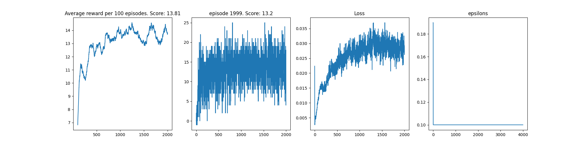

# Project Report

The goal of this project was to solve the banana navigation unity environment. The state space is continuous of 37 dimension with values between 0 and 1. The action space is discrete of having 4 possible integral values between o and 4 (inclusive). The reward is either +1 for success and -1 for failure. 

### Agent Design

A Deep Q Network was used to train the agent. There's a target network that's updated frequently to prevent unstable behaviour. A transition of state, action, next state and reward were stored in a replay buffer of a maximum size 10000. Transitions from the buffer were later sampled for updating the DQN. Actions were selected using an epsilon-greedy style of controling exploration and exploitation. 

### Model Architecture

The neural network model used for functional approximation was an MLP with 2 hidden layers of hidden size 64 and 32. The input layer recieves the state with a size of 37 while the output layer has 4 unit which corresponds to the size of the action. 

### Parameters

The model was trained with an adam optimizer using a learning rate of 5e-5 and a batch size of 64. The parameters used are describe in the table below. 

|  Name | Data Type  | Use  | Value |
|:------:|:-----------:|:-----:|:------:|
| Buffer size  |  int |  configuration for maximum capacity of the replay buffer |34|
| Learning rate  | float  |  model learing rate | 5e-5|
|  Target update | int  | Controls the frequency of updating the target network | 4|
| Epsilon Decay | float | This determines how the epsilon decreases during training| 0.9 |
| Gamma | float | discount factor | 0.99 |

### Results

The agent was able to get an average score (over 100 episode) of 13 in about 500 episodes. The graph of the result is shown below. The graph also includes the loss and epsilon. The saved weights can be found in the model_weight directory as `model_weight/dqn.pt`

### Credit

Most of the code structure for DQN followed this projects [here](https://github.com/Curt-Park/rainbow-is-all-you-need)